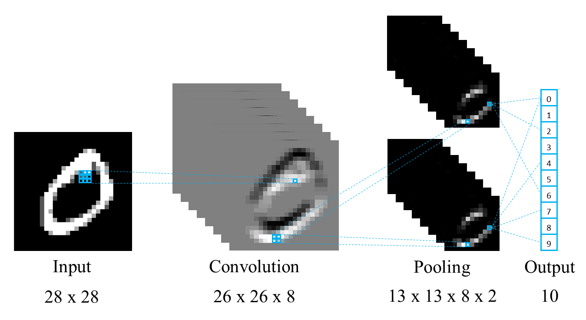

Spiking Neural P Systems for Image Classification
=================================================

This project implements an extended model of Spiking Neural P Systems applied to image classification tasks. The framework supports both small example systems and a multilayer architecture designed for processing structured inputs such as images.

The project has been developed in collaboration between the University of Milano-Bicocca and the University of Verona.

The initial codebase is a fork of:
https://github.com/a1sabau/spiking-p-system

The framework includes:
- Extended SN P systems (multi-spike firing rules)
- White hole mechanism
- Inhibitory synapses with anti-spikes
- Lightweight architecture without synaptic weights

It can be used to run small SN P system examples or a multilayer model for classification tasks, as illustrated below.

Installation
------------

Clone the repository:

.. code-block:: bash

   git clone <your-repo-url>
   cd <your-repo-folder>

Create a virtual environment (optional but recommended):

.. code-block:: bash

   python -m venv venv
   source venv/bin/activate  # Linux / Mac
   venv\Scripts\activate     # Windows

Install dependencies:

.. code-block:: bash

   pip install -r requirements.txt

Usage
-----

Run the main simulation:

.. code-block:: bash

   python main.py

If a different entry point is used:

.. code-block:: bash

   python colab_main.py

Experiments can be executed by varying parameters such as random seeds and configuration values directly in the code.

GUI
---

To launch the graphical interface:

.. code-block:: bash

   python gui.py

The GUI allows interactive inspection and execution of SN P systems.

Notes
-----

The model avoids the use of synaptic weights in order to remain as faithful as possible to the original P system framework. This results in a lightweight computational model, where performance is influenced primarily by structural design choices rather than parameter tuning.

This repository is associated with a research paper currently under review:

- *Towards a lightweight Spiking Neural P system for image recognition*
- Authors: Erba Sandro et al.
- Submitted to UCNC 2026.
